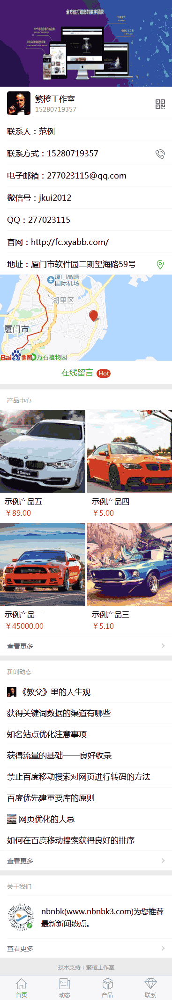

# xcxcms
微信小程序cms

# 目录结构

1、miniprogram，小程序目录

2、server，小程序后端目录，基于ThinkPHP5

# 小程序后端说明

1、基于ThinkPHP5，初始绑定的域名是www.nbnbk3.com，自行修改成自己要绑定的域名，以下说明如果遇到www.nbnbk3.com请修改成自己的域名

2、PHP+Mysql

3、后台登录：http://www.nbnbk3.com/fladmin/Login，账号：admin888，密码：admin

4、恢复后台默认账号密码：http://www.nbnbk3.com/fladmin/Login/recoverpwd

# 安装

1、 导入数据库

1) 打开根目录下的xcxcms.sql文件，将 http://www.nbnbk3.com 改成自己的站点根网址，格式：http://+域名

2) 导入数据库

2、 修改数据库连接参数

打开/apphome/database.php文件,修改相关配置

3、 域名绑定到server/public目录

4、 登录后台->系统设置->系统配置参数，更新配置：http://www.nbnbk3.com/fladmin/Index/upconfig

5、 打开miniprogram目录下的config.js文件，修改【appApiUrl: "http://www.nbnbk3.com/api"】为【appApiUrl: "http://+域名/api"】，这个是为小程序提供数据的api接口路径