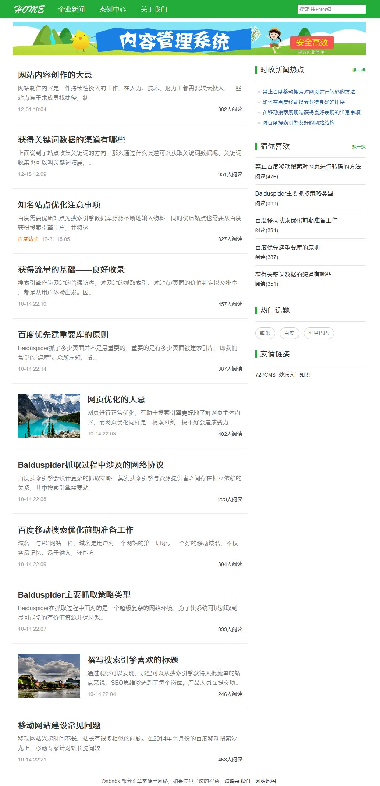
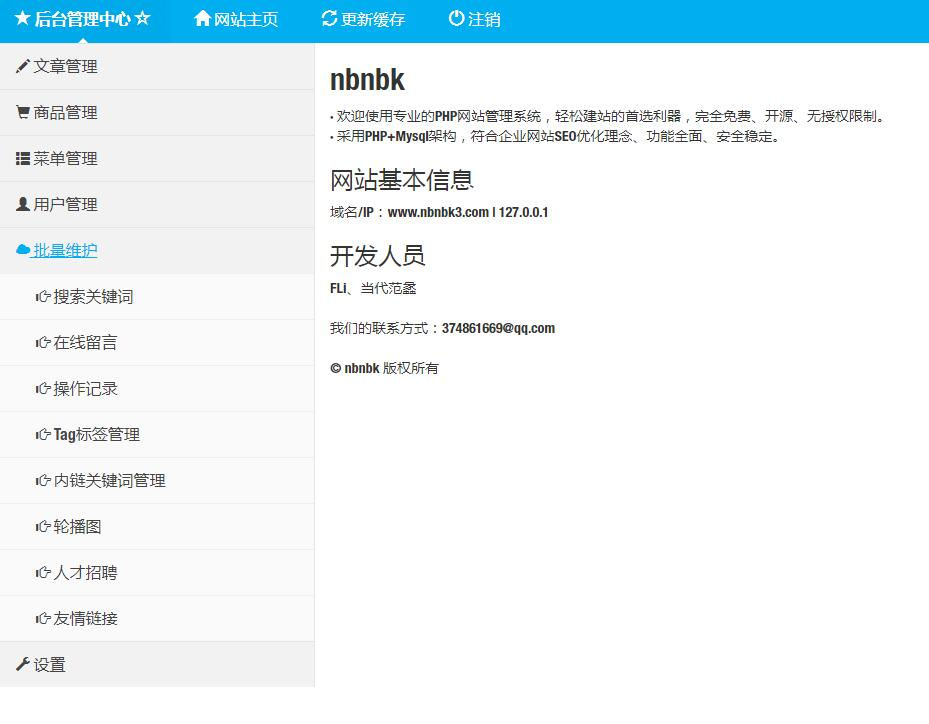

# nbnbk
基于thinkphp5的cms

PC端

WAP端

后台管理

# 说明

1、基于ThinkPHP5

2、PHP+Mysql

3、后台登录：http://www.nbnbk3.com/fladmin/Login，账号：admin888，密码：123456

4、恢复后台默认账号密码：http://www.nbnbk3.com/fladmin/Login/recoverpwd

5、tp5开源cms，适合博客、中小企业建站二次开发。

6、http://www.nbnbk3.com只是示例域名，需换成自己绑定的域名

注意：WAP端的域名通常是PC端的子域名，这里PC端的域名是www.nbnbk3.com，WAP端的域名是m.nbnbk3.com，子域名不是m就要修改application/route.php下的m

<strong>PC入口</strong>：http://+PC域名+/

<strong>WAP入口</strong>：http://+WAP域名+/，WAP域名解析与PC域名一致，都是指向同一目录下

7、后台功能
1) 文章管理：增删改查，栏目管理
2) 单页管理
3) RBAC权限管理，角色管理
4) 商品管理：商品品牌，商品分类
5) 轮播图
6) 友情链接
7) 系统参数配置

8、前台功能
1) 公司介绍
2) 产品中心
3) 新闻动态
4) 联系我们
5) 友情链接

# 安装

跟thinkphp5安装一样，只是多了一步数据库导入

1、 导入数据库

1) 打开根目录下的nbnbk.sql文件，替换文件里面的 http://www.nbnbk3.com 为自己的站点根网址，格式：http(s)://+域名

2) 导入数据库

2、 修改数据库连接参数

打开/application/database.php文件,修改相关配置

3、 登录后台->系统设置->系统配置参数，更新配置：http://www.nbnbk3.com/fladmin/Index/upcache

# 注意

站点只能放在根目录
